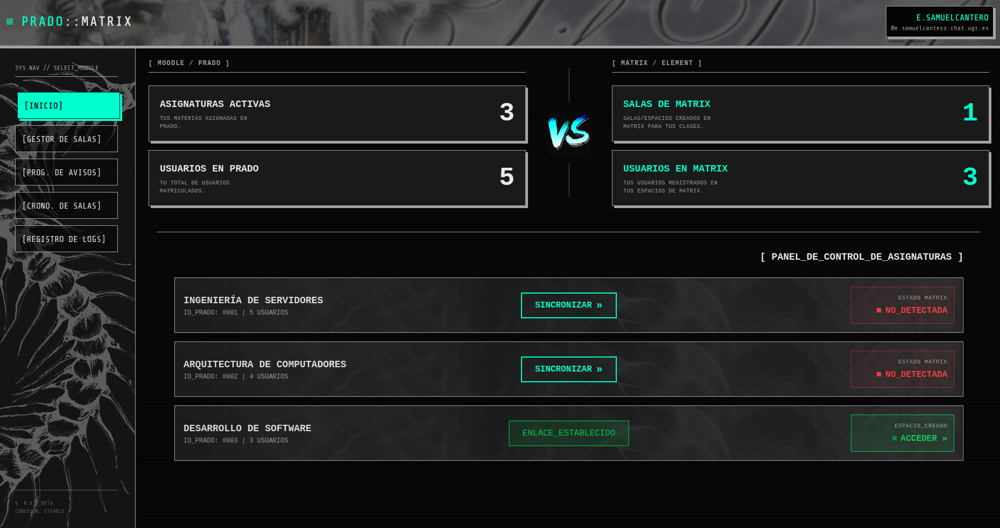
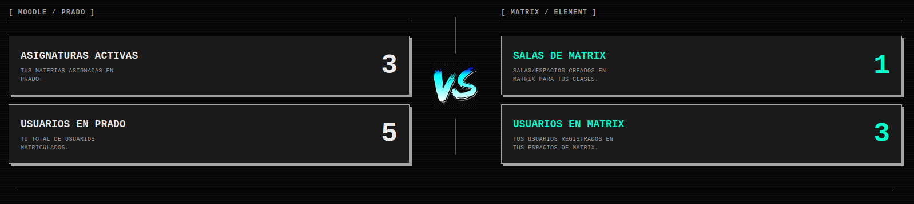
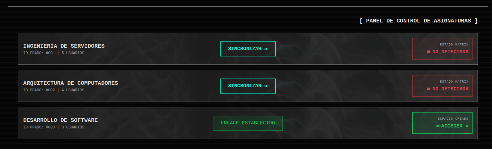

El **Panel de Inicio** es la pantalla principal que aparce al abrir la aplicación. SU objetivo principal es actuar como cuente de conexión entre la Moodle de Prado y la plataforma de mensajería de Matrix. 

Desde esta pantalla el profesorado puede ejecutar la sincronización masiva para crear instantáneamente la infraestructura de comunicación de sus asignaturas con un solo clic.

### 1. Panel de Estadísticas 

En la zona superior de la pantalla, el sistema presenta un resumen visual del estado actual , dividido en dos grandes bloques:

- **MOODLE / PRADO :** Muestra el número total de asignaturas activas que el profesor imparte , junto con la suma total de estudiantes matriculados en todas ellas.
- **MATRIX / ELEMENT :** Refleja la huella del profesor en la red de mensajería, mostrando cuántas salas o espacios han sido creados y cuántos alumnos han sido ya importados al sistema de chat.

### 2. El Panel de Control de Asignaturas

La zona inferior central de la pantalla esta ocupada por el listado de asignaturas que imparte el profesor. El listado de asignaturas se extrae de Prado y se representa con un rectángulo dividido en tres columnas lógicas:

1. **Información de Prado (Izquierda):** Muestra el nombre oficial de la asignatura, su identificador único y el el número de alumnos total que la componen.
2. **Botón de acción (Centro):** El botón que ejecuta la sincronización.
3. **Estado en Matrix (Derecha):** Un indicador que muestra la situación de la asignatura en el servidor de chat.

Una vez que se activa la sincronización, se realizan las peticiones a Matrix. El cambio principal que veremos reflejado en la interfaz es que ahora el **botón de acción** del centro se convierte en un panel informativo verde con el texto "ENLACE_ESTABLECIDO". Además para acceder al espacio generado, podemos pulsar en el botón derecho que se nos activa en la columna de **Estado en Matrix**.

### 3. ¿Qué ocurre internamente al pulsar "Sincronizar"?

Cuando el profesor hace clic en sincronizar, el sistema no se limita a crear una sala de chat vacía. En segundo plano, el backend ejecuta una serie de eventos a la API de Matrix:

1. **Creación del Espacio:** El sistema crea un "Espacio" en Matrix con el nombre exacto de la asignatura. El profesor es configurado automáticamente como Administrador, mientras que los alumnos heredarán el rol de usuarios estándar.
2. **Volcado Masivo de Usuarios:** El backend cruza la lista de alumnos de Prado e intenta insertarlos en el nuevo espacio de Matrix.
3. **Inserción Forzada:** En sistemas Matrix tradicionales, al invitar a un usuario, este debe abrir la aplicación y "Aceptar" la invitación manualmente para poder ver la sala. Nuestro sistema elimina esto. Se configuran permisos de inserción automática, lo que significa que el alumno ya está dentro del chat sin tener que aprobar nada

>**Nota importante:** Sin embargo, con esto surge un problema, y es que no podemos insertar a un usuario en una sala que no se encuentra en la base de datos de Synapse (es decir que que no se ha registrado todavía en el Matrix). Para solucionar esto, nuestra aplicación esta diseñada para pre-insertar a estos usuarios de tal manera que cuando el estudiante inicie sesión por primera vez con sus credenciales de la UGR, se encontrará automáticamente dentro del espacio de la asignatura, evitando errores del tipo "usuario no encontrado".

4. **Actualización de Estadísticas:** Tras finalizar la sincronización, el frontend vuelve a consultar la base de datos, refrescando las estadísticas de la zona superior instantáneamente.