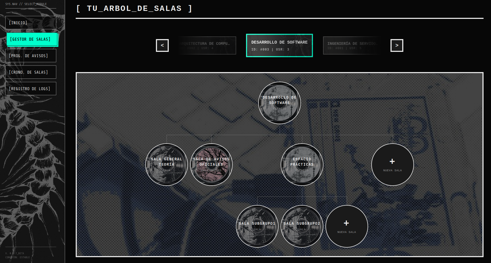
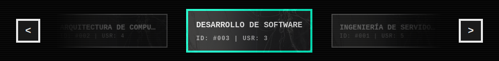
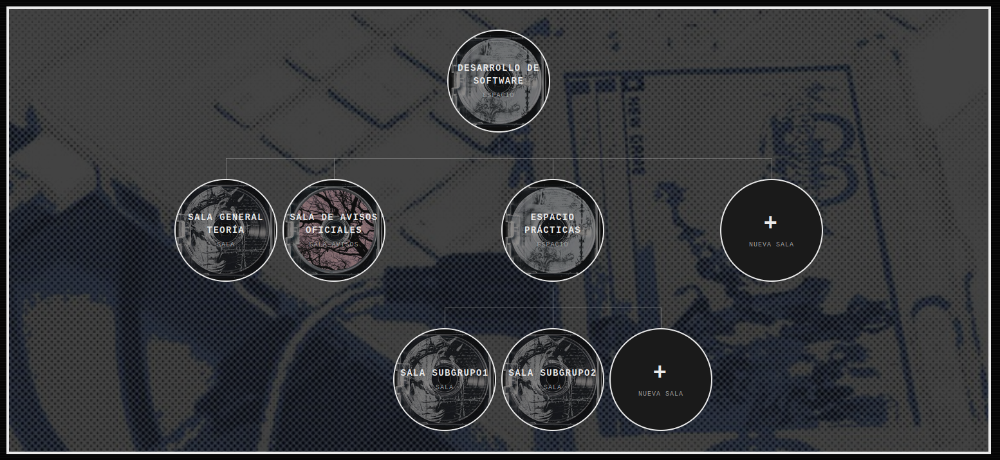
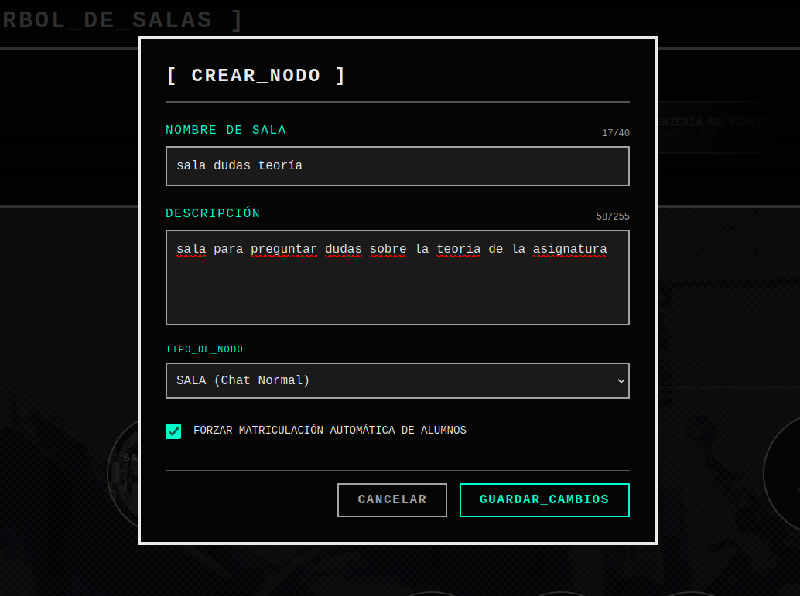
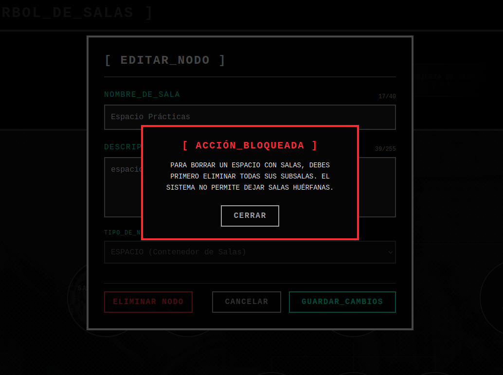

El **Gestor de Salas** es la pantalla principal para organizar la jerarquía de salas de nuestros espacios principales. Gracias a esto cada profesor podrá gestionar su propio grupo mediante Espacios (que actúan como carpetas) y las Salas (que son los chats).

Este panel nos permite diseñar, crear y modificar toda esta arquitectura de forma cisual sin necesidad de entrar a la interfaz de element.

### 1. El Carrusel de Asignaturas

En la parte superior de la pantalla,el panel tiene un carrusel dinámico de navegación. El usuario puede desplazarse lateralmente con los botones de dirección para centrar la asignatura sobre la que desea trabajar

La asignatura central se resalta con un borde turquesa brillante, y es la que establece todo el contexto de la pantalla inferior. Además podemos ver en ese panel información general de la asignatura como su ID oficial y el número de usuarios.

### 2. El Árbol de Salas 

Una vez seleccionada una asignatura sincronizada, el panel central dibuja una jerarquía interactiva que lee en tiempo real la estructura oficial de la API de Synapse y de nuestra base de datos local.

El árbol representa visualmente la jerarquía mediante nodos conectados por líneas. Existen tres tipos fundamentales de nodos, diferenciados por su diseño:

1. **Espacio:** Actúa como una carpeta. Puede contener otras salas o subespacios dentro de él. Visualmente de este nodo cuelgan ramas hacia sus hijos.
2. **Sala Normal:** Un chat estándar donde profesores y alumnos pueden escribir libremente.
3. **Sala de Avisos:** Un canal unidireccional donde los profesores pueden escribir pero los alumnos solo pueden leer.

Al final de las de las ramas de cada nivel, la aplicación añade un nodo interactivo con el símbolo de **[ + ]**. Al pulsar sobre él se indica al sistema que queremos crear una nueva sala dentro de ese nivel.

### 3. Creación y Edición de Nodos

Al hacer clic sobre un nodo existente (para editarlo) o sobre el botón de añadir (para crear uno nuevo), la interfaz superpone un formulario.

#### A. Campos de Configuración

El profesor puede definir el: 
- **Nombre** de la sala (hasta 40 caracteres) 
- **Descripción**  (hasta 255 caracteres) que los alumnos leerán en el encabezado del chat. 
- **Tipo de Nodo** Puede ser un espacio una sala o una sala de avisos.

> **Nota importante:** Si un nodo fue creado originalmente como un espacio y ya contiene salas en su interior, el backend bloquea la posibilidad de transformarlo en una sala normal. Esto evita que la base de datos se corrompa, generando salas (que no espacios) con hijos. 

#### B. Matriculación automática

Durante la _creación_ de una sala, el formulario despliega una opción, la casilla de **"Forzar matriculación automática de alumnos"**. Gracias a esta funcionalidad nuestra aplicación inserta todos los usuarios del espacio raíz en el nuevo nodo generado. Es decir en el instante en el que el profesor crea una sala, esta aparece inmediatamente en la pantalla de todos los estudiantes listos para chatear.

### 4. Eliminación Segura

Si un profesor decide borrar una sala, el botón de "Eliminar Nodo" (disponible desde el menú de edición) despliega un panel de confirmación. Aquí intervienen medidas de seguridad para la integridad de la base de datos:

- **Salas u Espacios Vacíos:** Si se intenta borrar un chat final o una carpeta vacía, el sistema permite la acción. Advierte de que el borrado es irreversible y eliminará el historial de Matrix permanentemente.
- **Bloqueo de Espacios :** Si el profesor intenta borrar un "Espacio" (Nodo Padre) que todavía tiene salas colgando de él, el panel detecta a los "hijos" y deshabilita por completo el botón de borrado. El sistema obliga al profesor a vaciar primero la carpeta (borrando las sub-salas una a una) antes de poder destruir el contenedor principal. 

