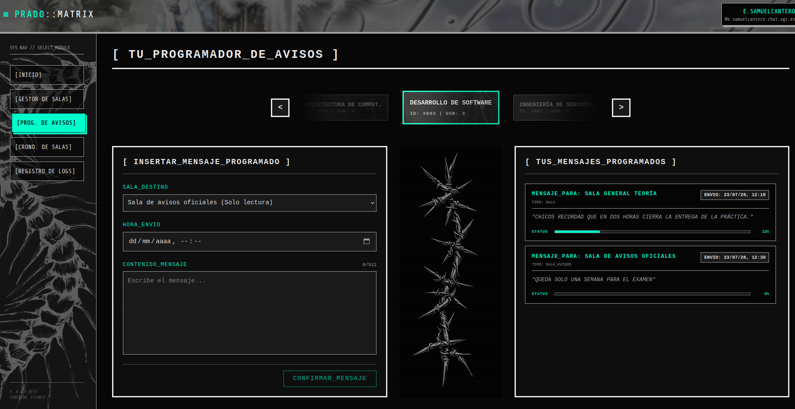
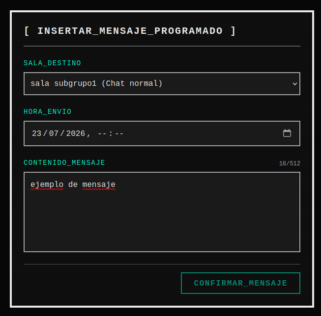
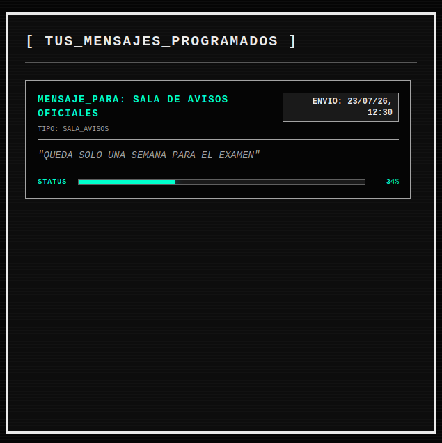
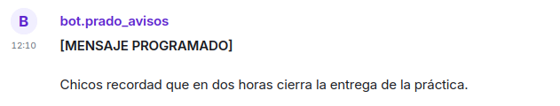

El **Programador de Avisos** es la pantalla para automatizar mensajes dentro de nuestras salas de la asignatura. Permite al profesorado redactar mensajes, recordatorios, entregas, anuncios etc y programarlos para que se publiquen automáticamente en una fecha y hora exactas en el futuro.

es la herramienta diseñada para automatizar las comunicaciones oficiales de la asignatura. Permite al profesorado redactar mensajes institucionales, recordatorios de entregas o anuncios de exámenes, y programarlos para que se publiquen automáticamente en una fecha y hora exactas en el futuro.

### 1. Navegación y Validación de Salas

Al igual que en el Gestor de Salas, la pantalla está organizada por el **Carrusel de Asignaturas** superior. Para poder programar un aviso, la asignatura seleccionada debe cumplir dos requisitos principales que el panel verifica:

1. **Debe estar sincronizada** con Matrix.
2. **Debe contener al menos una sala** (Sala Normal o Sala de Avisos). Si la asignatura solo contiene "Espacios", la interfaz se bloquea y pedirá al profesor que cree primero un chat desde el Gestor de Salas.

### 2. Formulario de Inserción (Columna Izquierda)

Una vez seleccionada una asignatura válida, la columna izquierda despliega el formulario interactivo. Este panel tiene tres parámetros:

- **Sala Destino:** Un menú desplegable que lista los chats válidos para recibir mensajes (es decir excluye a los espacios).
- **Hora de Envío:** Un selector para la fecha y la hora. Además por seguridad la aplicación bloquea cualquier intento de seleccionar horas anteriores al minuto actual.
- **Contenido del Mensaje:** Un área de texto con un límite de 512 caracteres.

Al pulsar **[ CONFIRMAR_MENSAJE ]**, la orden no se envía a Matrix, sino que se guarda de forma segura en la base de datos interna de la aplicación.

### 3. Cola de Mensajes  (Columna Derecha)

En la derecha de la pantalla, se muestra una cola de mensajes con scroll vertical. Aquí se listan de forma cronológica (los más antiguos arriba) todos los mensajes programados que están espeando a ser enviados.

Cada mensaje programado es una tarjeta interactiva que muestra:

- La sala de y la hora exacta de destino.
- Parte del contenido del mensaje.
- **La Barra de Progreso:** Una barra visual en color turquesa que calcula en tiempo real el porcentaje de tiempo transcurrido desde que se creó el mensaje hasta la hora límite a la que debe de enviarse.

### 4. Edición y Cancelación de Envíos

Si el profesor se equivoca en una fecha o desea modificar un texto antes de que sea publicado, basta con **hacer clic sobre cualquier tarjeta** de la cola de mensajes.

Esto nos abre un formulario de edición que extrae los datos de el mensaje, y nos permite cambiar la nueva feha/hora o bien el contenido del mensaje. Además si el anuncio ya no es necesario, también podemos borrar el mensaje pulsando el botón de **[ ELIMINAR ]**.
### 5. ¿Qué ocurre internamente? 

Para entender este módulo, es fundamental comprender cómo se entregan los mensajes. Cuando llega la hora programada, **no es la cuenta personal del profesor la que envía el mensaje**.

La aplicación se apoya en un bot el cual enviará el mensaje automático por nosotros `@bot.prado_avisos:chat.ugr.es`.

1. Al crear una sala, el sistema invita e introduce automáticamente a este Bot de manera invisible con permisos de moderador, es decir que es inmune a restricciones de enviar mensajes.
2.  En el servidor (Backend), existe un "cronómetro" . Cada 60 segundos revisa la base de datos y si encuentra un mensaje cuya fecha programada coincide con el reloj actual, dispara el mensaje.

