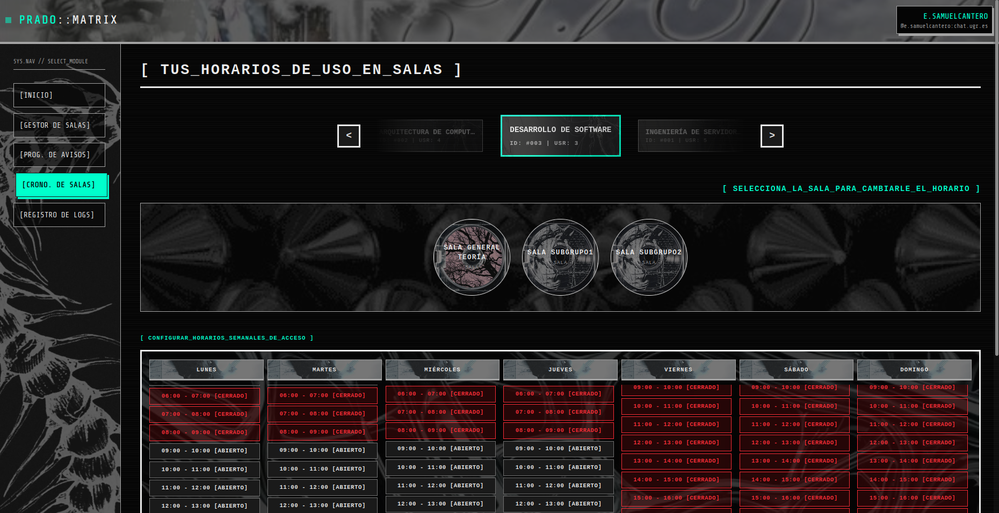
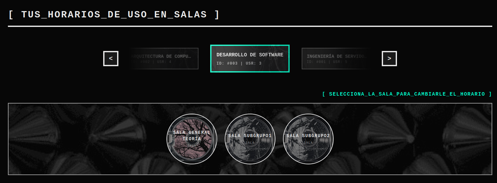
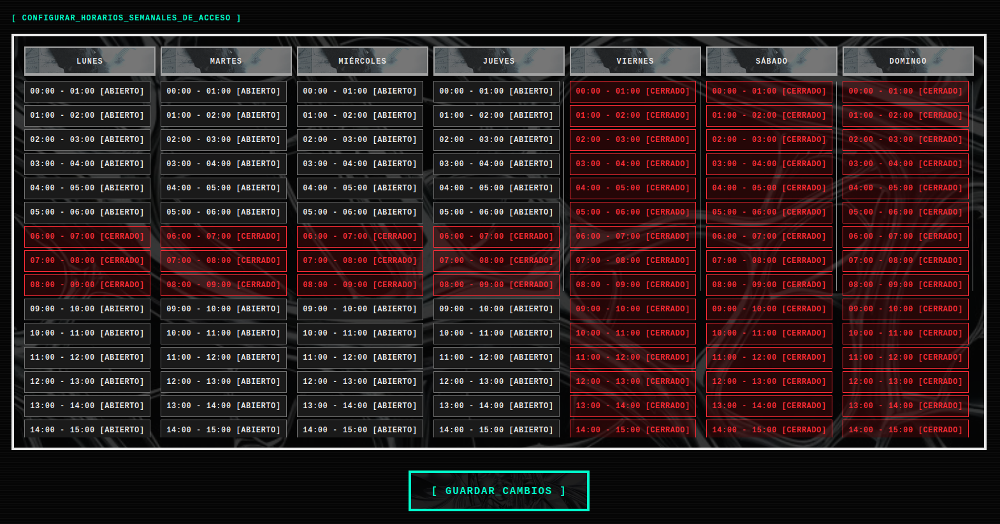

El **Cronograma de Salas** es el módulo encargado de gestionar de forma automatizada los permisos de escritura de los estudiantes. Actúa como una berja que el profesor puede programar para que se abra y se cierre en horarios específicos.

Su objetivo principal es garantizar el derecho de desconexión digital, silenciando automáticamente las salas del chat fuera del horario de tutorías o durante los fines de semana, impidiendo que los alumnos envíen mensajes hasta que el canal vuelva a abrirse.

### 1. Navegación y Selección de Sala

La pestaña tiene la siguiente estructura en la parte superior:
1. **Carrusel de Asignaturas:** Funciona de manera idéntica al resto de paneles. Además la aplicación se encarga de verificar que la asignatura esté sincronizada con el Matrix y que disponga de salas operativas.
2. **Selector Horizontal de Salas:** Justo debajo, se despliega una barra navegable con todas las salas de la asignatura. Este listado excluye automáticamente a los Espacios y las Salas de avisos, mostrando únicamente las salas normales. Estas salas son las únicas en las que tiene sentido regular el horario de acceso. Al hacer click ese nodo se marca como activo y se carga su horario específico en la parte inferior.

> **Nota importante** Si un profesor realiza modificaciones en el horario de una sala y, por error, hace clic en otra sala distinta sin haber guardado, la aplicación lo detecta y le envía una alerta de confirmación para que no se le olvide guardar.

### 2. La Matriz Semanal

Una vez seleccionada la sala, el panel inferior dibuja una cuadrícula interactiva dividida en 7 columnas (de Lunes a Domingo). Cada columna contiene bloques de una hora (desde las 0:00 hata las 23:59), navegables mediante scroll vertical.

El profesor puede modificar el estado de cada hora interactuando directamente con la cuadrícula.

Una vez seleccionada la sala, el panel inferior dibuja la herramienta principal: una cuadrícula interactiva dividida en 7 columnas (de Lunes a Domingo). Cada columna contiene bloques de una hora (desde las 00:00 hasta las 23:59), navegables mediante _scroll_ vertical independiente.

El profesor puede modificar el estado de cada bloque horario interactuando directamente con la cuadrícula:

- **[ ABIERTO ] (Estado por defecto):** Durante esta hora, los alumnos pueden enviar mensajes libremente.
- **[ CERRADO ] :** Al hacer clic sobre una hora, esta se bloquea. Durante esta hora, la sala pasa a ser de "solo lectura" para los estudiantes.

> **Nota importante:** Para agilizar la configuración la matriz soporta eventos de arrastre (drag). EL profesor puede hacer clic en una hora, mantener pulsado el ratón y arrastras para alterar el valor de esa casilla, sin tener que hacer clic celda por celda.

Todos los cambios realizados no se aplican directamente, para ello tenemos que pulsar el botón de **[ GUARDAR_CAMBIOS ]** situado en la parte inferior. Al pulsarlo la matriz completa se envía al servidor.
### 3. ¿Qué ocurre internamente? 

Lo más relevante de este panel es en como el backend readuce la tabla en restricciones dentro de nuestro Matrix. Para ello:

1. **Modificamos permisos de enviar mensajes:** En Matrix, los permisos por defecto de una sala para hablar son de nivel 0 (el que tienen los estudiantes). Cuando este panel envía una petición para restringir una sala, modificamos ese nivel a 50. De esta manera los alumnos pierden la capacidad de escribir en el chat, mientrar que los profesores y el bot nunca pierden acceso.
2. **El  Cron:** Dentro del servidor se comprueba cada hora el estado actual del reloj del sistema, contra la matriz almacenada en la base de datos. Se comprueba si el estado de la sala en Matrix con el estado de la base de datos no coincide, y si no coincide se altera para que lo haga con los nuevos cambios, ejecutando así la petición.
3. **Cambio automático:** A su vez, si se detecta un cambio sobre la hora actual, también se efectúa la petición en el Matrix.