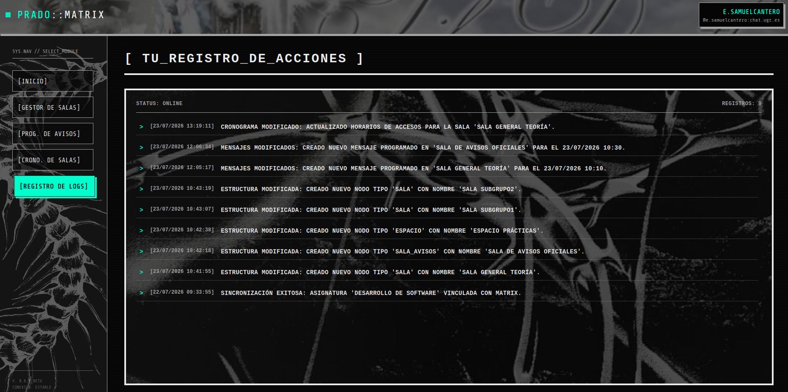

El **Registro de Logs** es un panel de solo lectura diseñado para que el profesorado tenga un historial inmutable de todas las acciones que se han ejecutado a través del Panel Prado-Matrix.

En esta pantalla se listan cronológicamente eventos como la sincronización exitosa de asignaturas, alteración en la jerarquía de espacios o la confirmación de que un aviso ha sido enviado correctamente por el bot. 

Cada registro indica la fecha y hora exacta el evento con una breve descripción en lenguaje natural, permitiendo que el docente pueda ver todas las configuraciones y acciones que se han realizado correctamente en el servidor.

